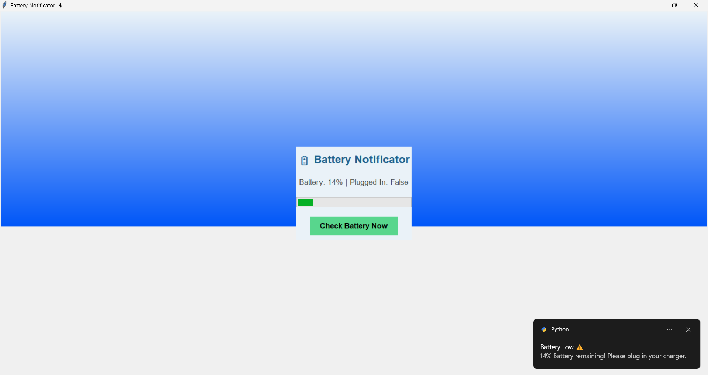

# Battery Notificator – Python Desktop Application
A lightweight Python-based desktop application that monitors your laptop’s battery status in real time and provides smart notifications for low or full battery levels. Built with Tkinter, psutil, and win10toast, this tool ensures you never miss important battery alerts.

---

## 🚀 Features
- Real-time battery percentage monitoring  
- Low battery and full charge notifications  
- Windows toast notifications using win10toast  
- Popup alerts using Tkinter  
- Smooth and responsive UI with multithreading  
- Gradient background and animated progress bar  
- Simple, clean GUI interface  
- Auto-refreshing battery status

---

## 🛠 Tech Stack
- **Python**  
- **Tkinter** (GUI)  
- **psutil** (battery monitoring)  
- **win10toast** (Windows notifications)  
- **threading** (smooth UI performance)

---

## 📂 Project Structure
Battery-notificator/
│── main.py          # Main application code
│── icons/           # Battery icons (if used)
│── README.md        # Project documentation

---

## ▶️ How to Run the Project

### 1. Clone the repository
```bash
git clone https://github.com/Priyanshi731/Battery-notificator-python.git

cd Battery-notificator-python
2. Install dependencies
pip install psutil
pip install win10toast
3. Run the application
python main.py
## 📸 Screenshots
Here is a preview of the Battery Notificator application:



